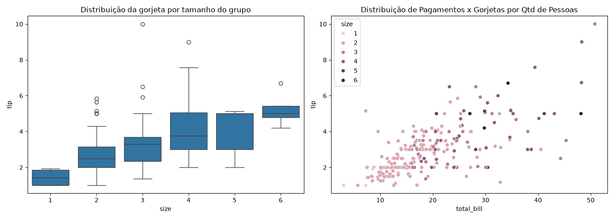
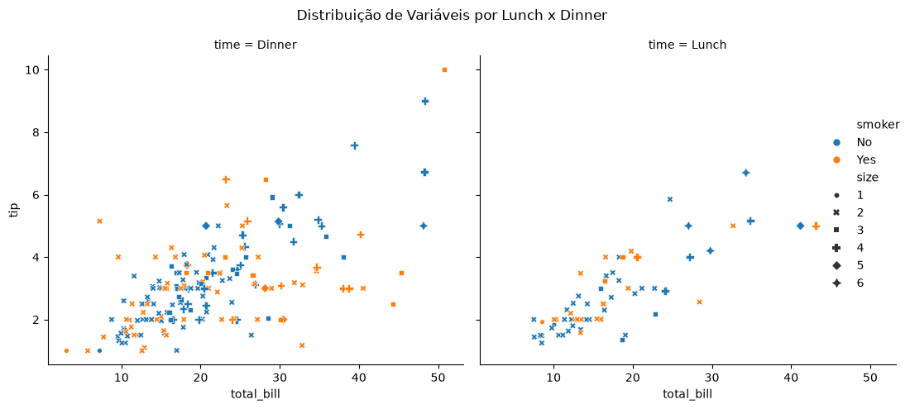

# 📊 Análise de Dataset de Gorjetas

Projeto de análise exploratória de dados (EDA) desenvolvido como parte de um BootCamp da DIO, utilizando Pandas, Matplotlib e Seaborn sobre o dataset tips.

## 🎯 Objetivo

Explorar o dataset de gorjetas de um restaurante para entender como fatores como valor da conta, dia da semana, horário, perfil do cliente e tamanho da mesa se relacionam com o valor da gorjeta.

## 🔍 Etapas da análise
### 1. Perfil geral dos dados 
- Dimensões (linhas/colunas)
- Tipos de dados
- Valores nulos e duplicados
- Estatísticas descritivas 

### 2. Verificando relação entre gorjetas por quantidade de pessoas
- total_bill, size, tip
- Gráficos: boxplot e scatterplot
- Pergunta: existe correlação? forte ou fraca? positiva ou negativa?

### 3. Distribuição das variáveis numéricas e categóricas
- total_bill, tip, size, smoker, time, day
- Gráficos: relplot e countplot
- Perguntas: os dados parecem normais? há assimetria? existem outliers?

## 🛠️ Tecnologias utilizadas
Python
Pandas
Matplotlib
Seaborn

## 👤 Autor

Eledilson B. github.com/EledilsonB